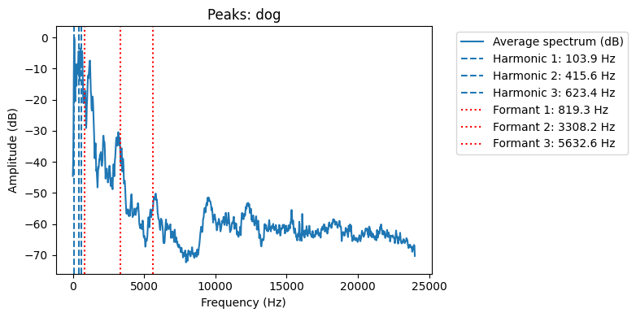

# Лабораторная работа №10. Обработка голоса

Результаты

| Файл | Мин/Макс, Гц    | f₀ (медиана), Гц | № обертонов         | Форманты, Гц           |
|------|-----------------|------------------|---------------------|------------------------|
| i    | 93.8 … 3234.4   | 204.3            | 408.5               | 274.2, 2048.0, 3574.8  |
| dog  | 46.9 … 1476.6   | 103.9            | 103.9, 415.6, 623.4 | 819.3, 3308.2, 5632.6  |
| a    | 70.3 … 3843.8   | 165.6            | 1159.2              | 277.3, 950.0, 3502.3   |

## Спектрограмма И

## Спектрограмма Лай

## Спектрограмма А

## Выводы

Диапазон частот звуков **"A"** и **"I"** достигает 3.2–3.8 кГц, что соответствует диапазону формант обычной человеческой речи. Вокализация **"dog"** ограничена ≈1.5 кГц, что подтверждает её имитационную природу и меньший спектральный охват.

- **"A"**:  
  *f₀ = 165.6 Гц* — соответствует диапазону мужского голоса.  
  Форманты: *F1 ≈ 277 Гц*, *F2 ≈ 950 Гц*, *F3 ≈ 3502 Гц* — характерны для открытого гласного [a], особенно выражен первый и третий резонанс.

- **"Dog"**:  
  *f₀ = 103.9 Гц* — низкий голос, характерный для грудного/басового звучания.  
  Форманты: *F1 ≈ 819 Гц*, *F2 ≈ 3308 Гц*, *F3 ≈ 5632 Гц* — указывают на фальцетную или звонкую составляющую, типичную для собачьего лая или его имитации.

- **"I"**:  
  *f₀ = 204.3 Гц* — ближе к области мужского фальцета.  
  Форманты: *F1 ≈ 274 Гц*, *F2 ≈ 2048 Гц*, *F3 ≈ 3574 Гц* — типичны для закрытого гласного [i]; особенно низкое F1 и высокое F2 указывают на переднюю, высокую артикуляцию.

---

Таким образом, акустический анализ показывает чёткие различия между звуками, соответствующие их артикуляционной природе.  
Формантные частоты позволяют достоверно классифицировать гласные и выявить особенности голосовой имитации — как в случае с **"dog"**.

P.S. Исходники звуков удалены