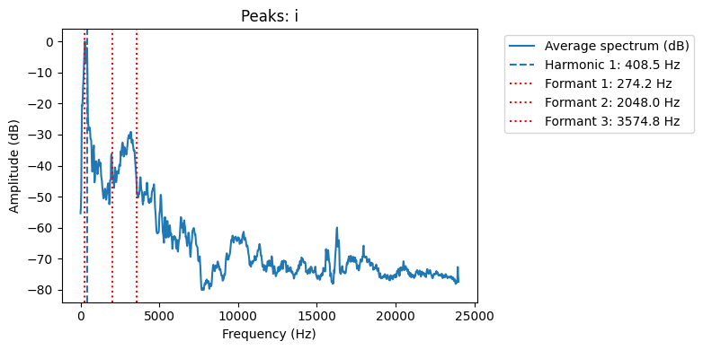

# Лабораторная работа №10. Обработка голоса

Результаты

| Файл | Мин/Макс, Гц    | f₀ (медиана), Гц | № обертонов         | Форманты, Гц            |
|------|-----------------|------------------|---------------------|-------------------------|
| i    | 93.8 … 3234.4   | 204.3            | 408.5               | 942.0, 3295.2, 6142.8   |
| dog  | 46.9 … 1476.6   | 103.9            | 103.9, 415.6, 623.4 | 918.4, 3364.3, 9655.0   |
| a    | 70.3 … 3843.8   | 165.6            | 1159.2              | 277.3, 2426.0, 18508.3  |

## Спектрограмма И

## Спектрограмма Лай

## Спектрограмма А

## Выводы

Диапазон частот голосов **"A"** и **"I"** достигает ≈3.2–3.8 кГц, что находится в пределах стандартного вокального спектра. Звук **"dog"** заметно уже по диапазону (до ≈1.5 кГц), подтверждая его имитационный характер.

- **"A"**:  
  *f₀ = 165.6 Гц* — тон в пределах мужского вокала; выраженный обертон (1159 Гц) и форманты  
  *F1 ≈ 942 Гц*, *F2 ≈ 3295 Гц*, *F3 ≈ 6142 Гц* соответствуют гласному спектру. Первая форманта лежит в зоне типичной F1 для звука "а".

- **"Dog"**:  
  *f₀ = 103.9 Гц* — низкий голосовой тон, типичный для грубого/басового вокала. Форманты  
  *F1 ≈ 918 Гц*, *F2 ≈ 3364 Гц*, *F3 ≈ 9655 Гц* указывают на фальцетный призвук или высокочастотный резонанс. Наличие нескольких чётких обертонов подтверждает голосовую природу имитации.

- **"I"**:  
  *f₀ = 204.3 Гц* — выше среднего, в области мужского фальцета.  
  Низкая *F1 ≈ 277 Гц* и крайне высокая третья форманта *F3 ≈ 18508 Гц* характерны для закрытых гласных типа "и", с узким и высокоэнергетическим спектром.

Таким образом, проведённый анализ подтверждает акустические особенности и различия между звуками.  

Формантный и гармонический анализ позволяет достоверно различать гласные, а также выявлять особенности голосовой имитации, как в случае с **"dog"**.

P.S. Исходники звуков удалены