# Лабораторная работа: Обесцвечивание и бинаризация растровых изображений

## Описание

В данной лабораторной работе выполняется преобразование изображений в полутоновые и бинарные изображения с использованием различных методов бинаризации. Для выполнения задания использовались изображения из папки `pictures_scr`, а результаты обработки были сохранены в папку `pictures_results`.

## Примененные методы

1. **Приведение к полутоновому изображению**  
   Для каждого изображения был вычислен яркостный канал, который использовался для преобразования в полутоновое изображение.

2. **Бинаризация с использованием порога**  
   Для каждого полутонового изображения был применен пороговый метод, при котором пиксели, яркость которых выше порога, становились белыми, а ниже – черными.

3. **Адаптивная бинаризация Бернсена (окно 5x5)**  
   Для изображений с неравномерным освещением была использована адаптивная бинаризация Бернсена. Порог для каждого пикселя вычисляется как среднее значение между минимальным и максимальным значением яркости в окрестности (окно 5x5).

## Результаты

### Пример 1: Изображение дома 

#### Исходное изображение:
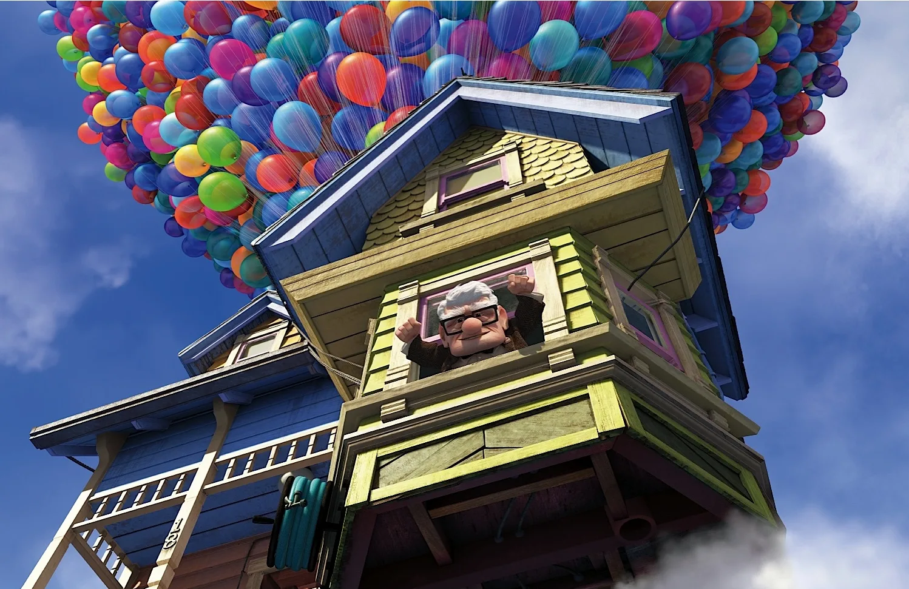

#### Полутоновое изображение:
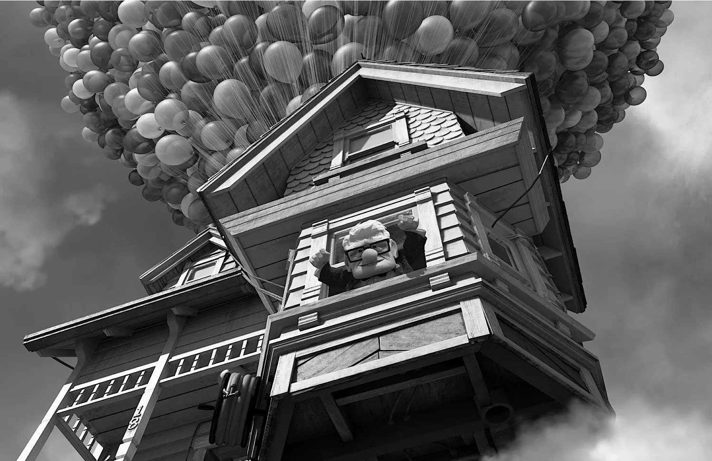

#### Бинаризация:
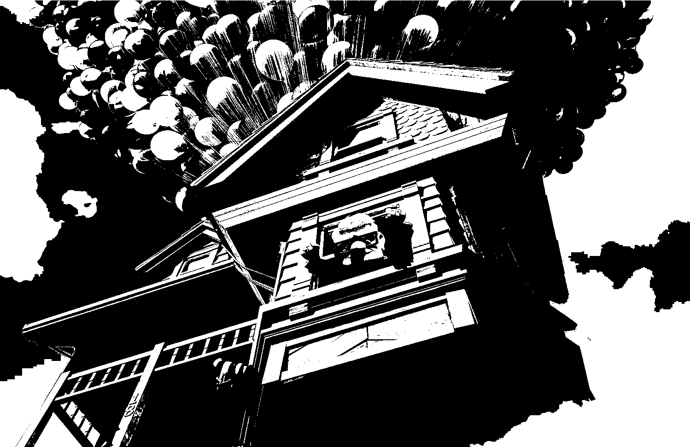

#### Адаптивная бинаризация Бернсена  (Окно 5x5):
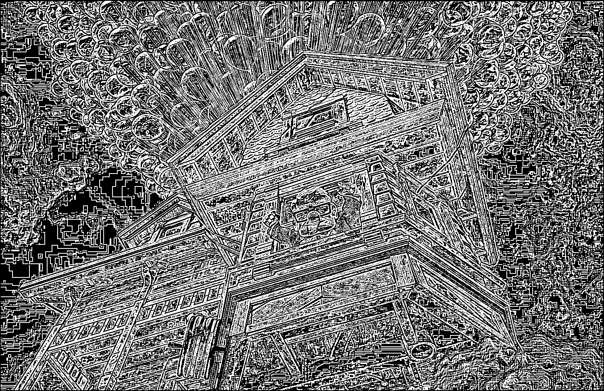

### Пример 2: Изображение карты 

#### Исходное изображение:

#### Полутоновое изображение:

#### Бинаризация:
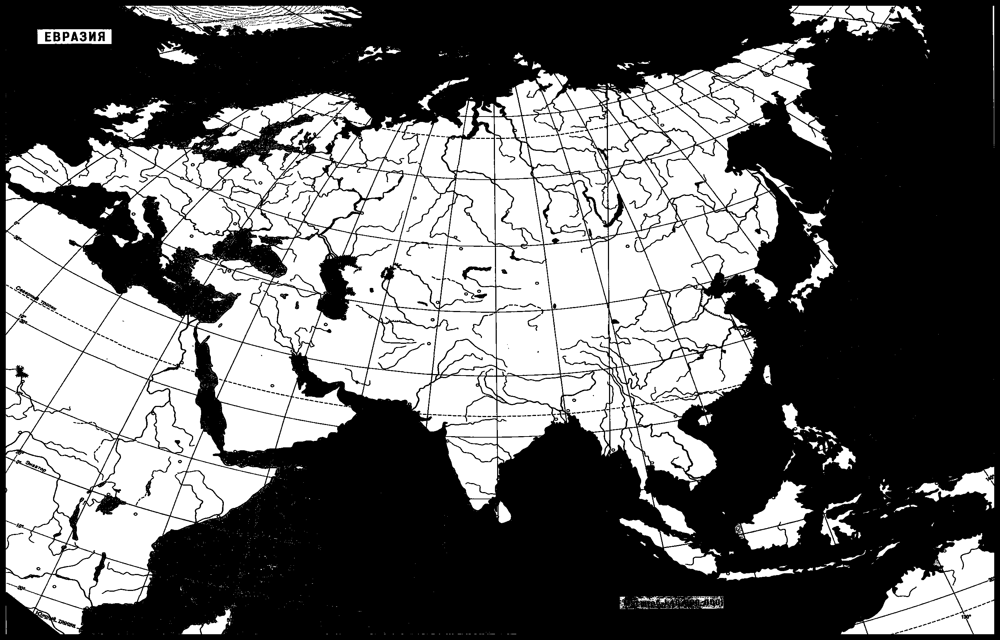

#### Адаптивная бинаризация Бернсена (Окно 5x5):
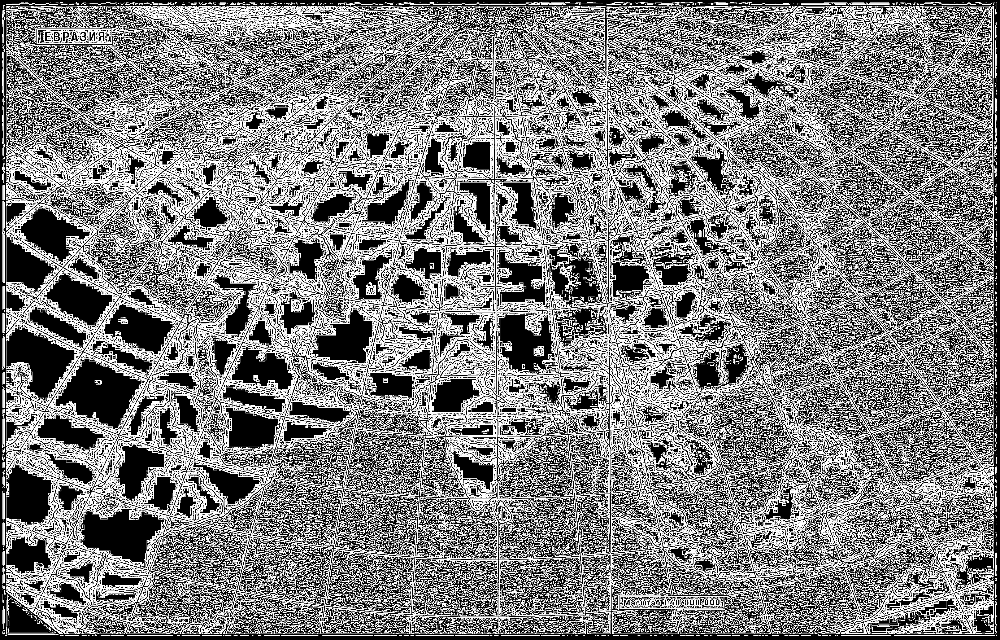

### Пример 3: Изображение Аниме

#### Исходное изображение:

#### Полутоновое изображение:

#### Бинаризация:
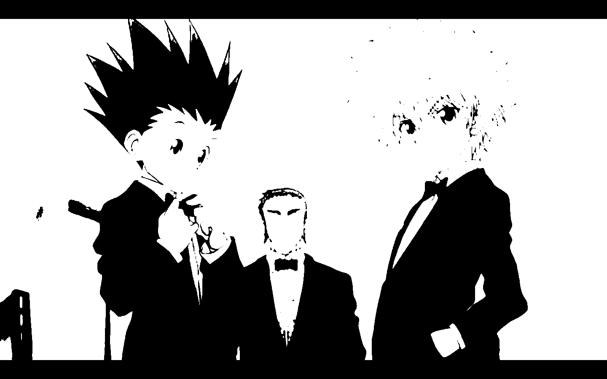

#### Адаптивная бинаризация Бернсена (Окно 5x5):
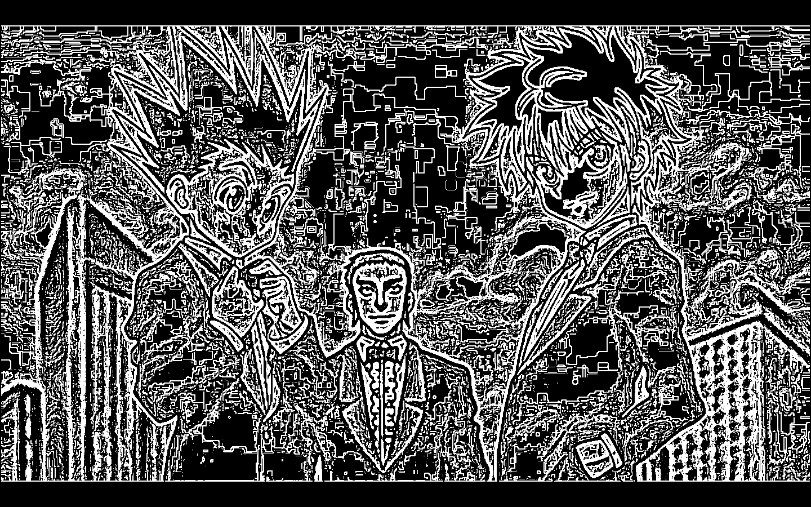

### Пример 4: Портрет 

#### Исходное изображение:

#### Полутоновое изображение:

#### Бинаризация:
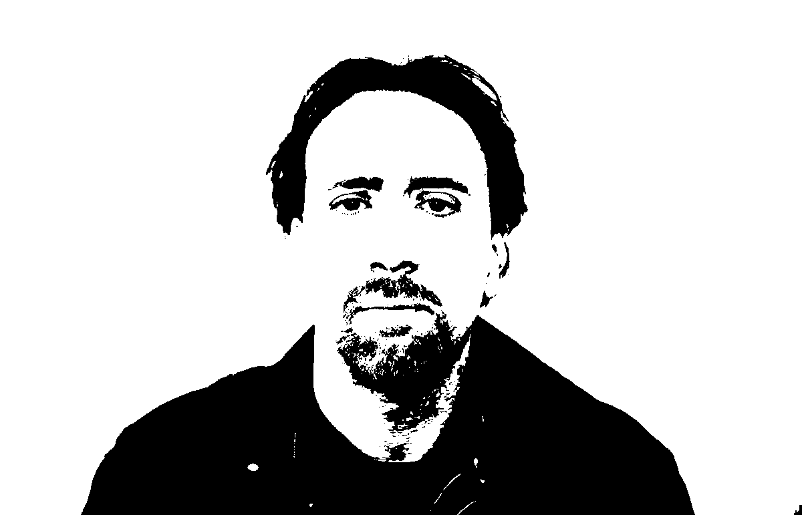

#### Адаптивная бинаризация Бернсена (Окно 5x5):
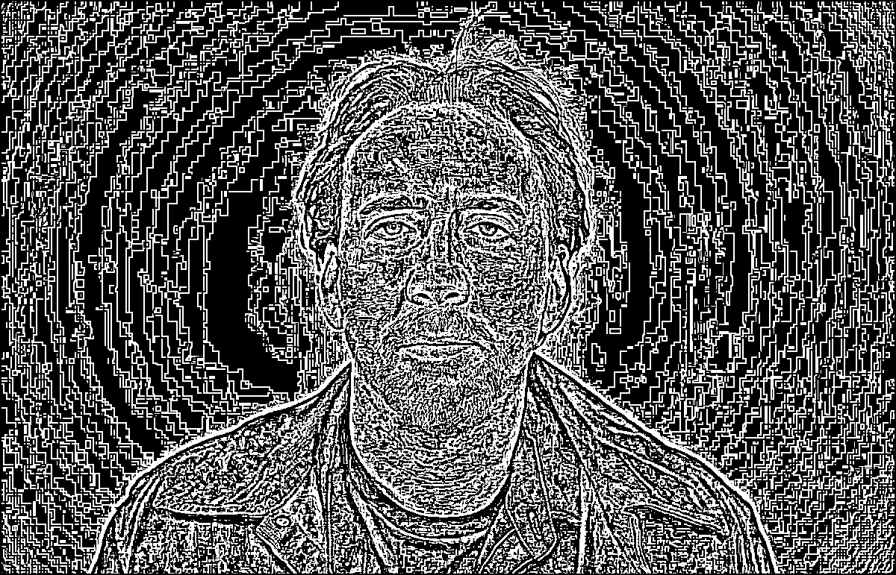

### Пример 5: Изображение Рентгена

#### Исходное изображение:
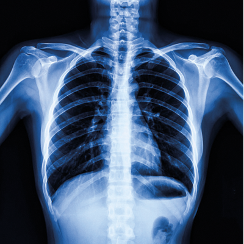

#### Полутоновое изображение:
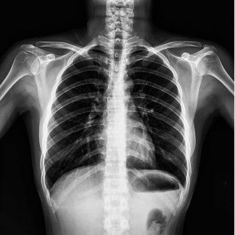

#### Бинаризация:
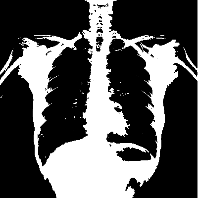

#### Адаптивная бинаризация Бернсена (Окно 5x5):
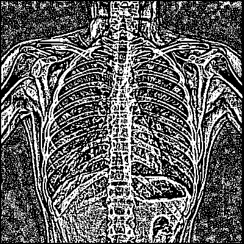

### Пример 6: Изображение Текста

#### Исходное изображение:

#### Полутоновое изображение:

#### Бинаризация:
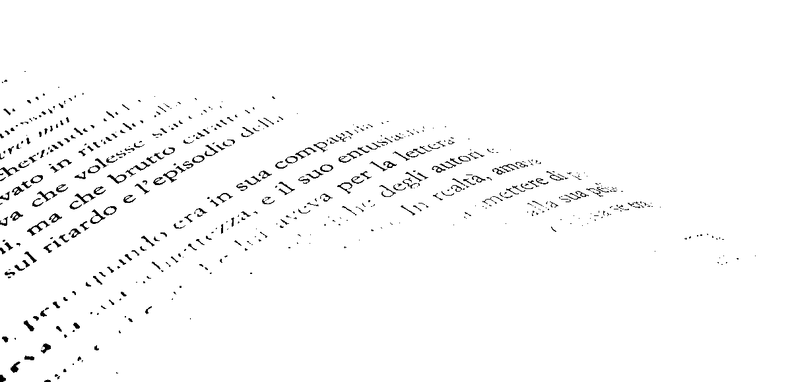

#### Адаптивная бинаризация Бернсена (Окно 5x5):
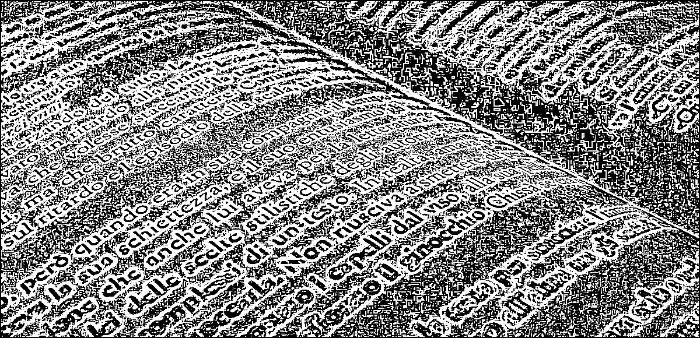

## Выводы по адаптивной бинаризации Бернсена 

### Плюсы:
- **Устойчивость к изменениям освещения**: Метод Бернсена использует локальный контраст, поэтому он хорошо работает на изображениях с неравномерным освещением.
- **Простота вычислений**: В отличие от сложных адаптивных методов, бинаризация Бернсена проста в реализации и работает достаточно быстро.

### Минусы:
- **Чувствительность к шуму**: Метод может неадекватно работать на изображениях с большим количеством шумов, так как опирается только на минимум и максимум яркости в окне.
- **Может не работать на низкоконтрастных изображениях**: Если разница между минимальной и максимальной яркостью в окне мала, метод может не дать хорошего результата.

## Заключение

Адаптивная бинаризация Бернсена является эффективным методом для обработки изображений с неравномерным освещением. Она позволяет выделять объекты даже в сложных условиях. Однако при наличии шума или низкого контраста необходимо использовать дополнительные фильтрации для улучшения результата.