# Лабораторная работа №5. Выделение признаков символов

## Символ - а

### Фото прямой буквы
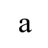

### Фото инвертированной буквы

### Профили буквы
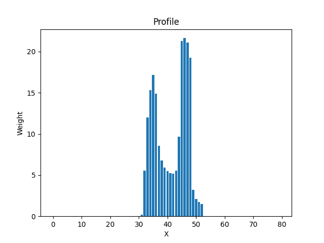
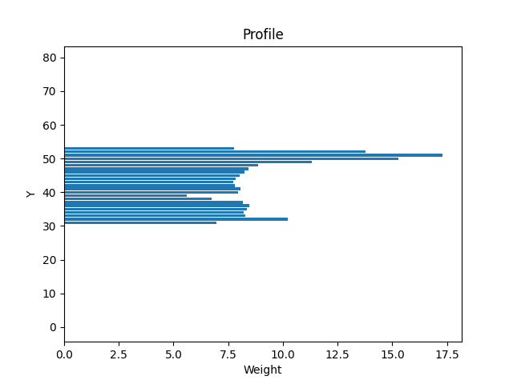

### Признаки:
1. Вес I - 28.55686274509804
2. Относительный вес I - 0.017848039215686274
3. Вес II - 42.43921568627451
4. Относительный вес II - 0.026524509803921566
5. Вес III - 57.84313725490196
6. Относительный вес III - 0.03615196078431373
7. Вес IV - 80.54901960784314
8. Относительный вес IV - 0.05034313725490196
9. Общий вес - 209.38823529411764
10. Относительный общий вес - 0.03271691176470588
11. Центр тяжести Y - 43.047758175075856
12. Центр тяжести X - 41.35404727122898
13. Относительный центр тяжести Y - 0.5380969771884482
14. Относительный центр тяжести X - 0.5169255908903623
15. Момент инерции Y - 6614.216040724264
16. Момент инерции X - 9972.879280994339
17. Относительный момент инерции Y - 0.0001614798838067447
18. Относительный момент инерции X - 0.00024347849807115085

## Символ - ә

### Фото прямой буквы
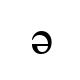

### Фото инвертированной буквы
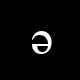

### Профили буквы
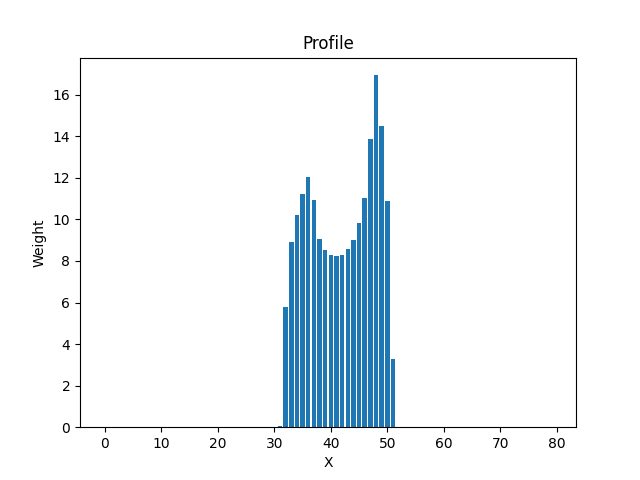
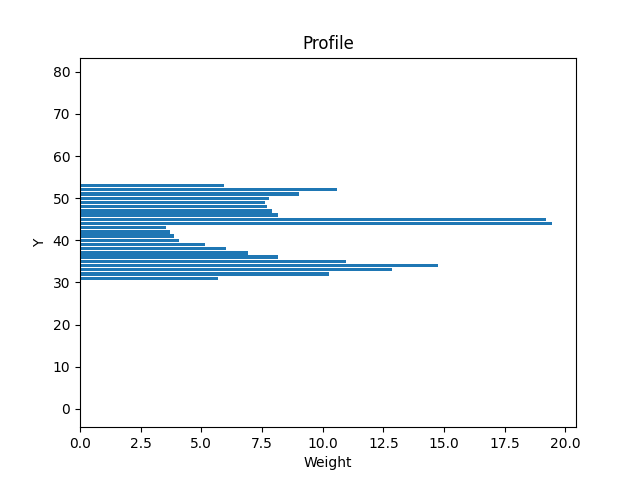

### Признаки:
1. Вес I - 24.99607843137255
2. Относительный вес I - 0.015622549019607843
3. Вес II - 55.80392156862745
4. Относительный вес II - 0.03487745098039216
5. Вес III - 51.67843137254902
6. Относительный вес III - 0.032299019607843135
7. Вес IV - 66.90980392156862
8. Относительный вес IV - 0.04181862745098039
9. Общий вес - 199.38823529411764
10. Относительный общий вес - 0.031154411764705882
11. Центр тяжести Y - 41.87896310282433
12. Центр тяжести X - 41.88480450003934
13. Относительный центр тяжести Y - 0.5234870387853041
14. Относительный центр тяжести X - 0.5235600562504917
15. Момент инерции Y - 6407.201176300904
16. Момент инерции X - 9106.404466410906
17. Относительный момент инерции Y - 0.0001564258099682838
18. Относительный момент инерции X - 0.000222324327793235

## Символ - б

### Фото прямой буквы
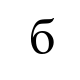

### Фото инвертированной буквы
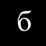

### Профили буквы
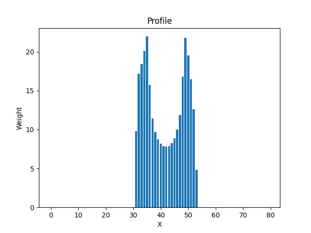
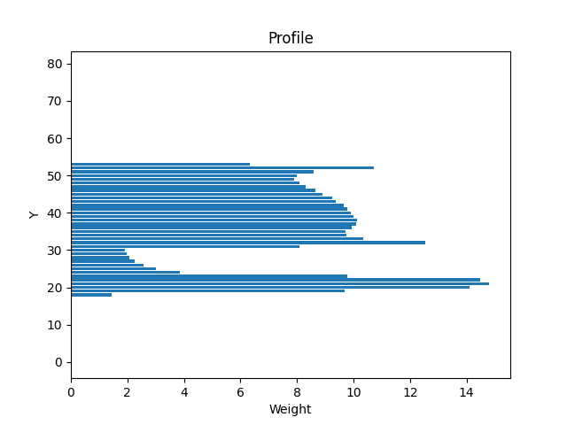

### Признаки:
1. Вес I - 72.72549019607843
2. Относительный вес I - 0.045453431372549015
3. Вес II - 99.80392156862744
4. Относительный вес II - 0.06237745098039215
5. Вес III - 60.36470588235294
6. Относительный вес III - 0.03772794117647059
7. Вес IV - 63.04705882352941
8. Относительный вес IV - 0.03940441176470588
9. Общий вес - 295.94117647058823
10. Относительный общий вес - 0.04624080882352941
11. Центр тяжести Y - 36.12858941231034
12. Центр тяжести X - 41.61869740939508
13. Относительный центр тяжести Y - 0.45160736765387927
14. Относительный центр тяжести X - 0.5202337176174385
15. Момент инерции Y - 14528.858893942523
16. Момент инерции X - 31997.569287619375
17. Относительный момент инерции Y - 0.0003547084690903936
18. Относительный момент инерции X - 0.0007811906564360199

## Символ - в

### Фото прямой буквы
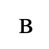

### Фото инвертированной буквы
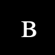

### Профили буквы
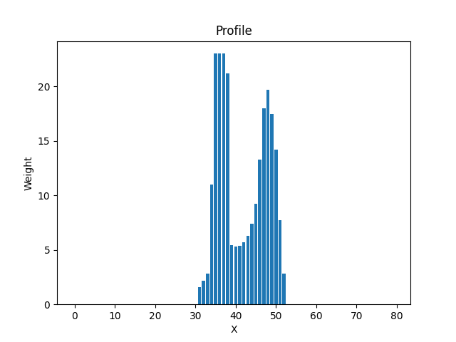
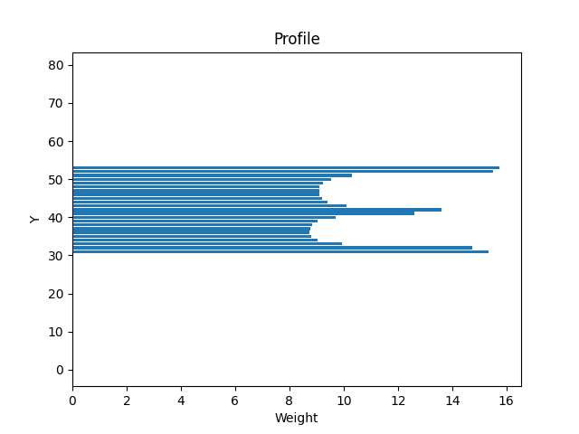

### Признаки:
1. Вес I - 44.831372549019605
2. Относительный вес I - 0.028019607843137253
3. Вес II - 48.41960784313726
4. Относительный вес II - 0.030262254901960786
5. Вес III - 68.31764705882352
6. Относительный вес III - 0.042698529411764705
7. Вес IV - 83.98823529411764
8. Относительный вес IV - 0.052492647058823526
9. Общий вес - 245.55686274509804
10. Относительный общий вес - 0.03836825980392157
11. Центр тяжести Y - 42.10187329319514
12. Центр тяжести X - 41.83739240142454
13. Относительный центр тяжести Y - 0.5262734161649393
14. Относительный центр тяжести X - 0.5229674050178067
15. Момент инерции Y - 8441.115017377664
16. Момент инерции X - 12139.086863775325
17. Относительный момент инерции Y - 0.00020608190960394687
18. Относительный момент инерции X - 0.0002963644253851398

## Символ - г

### Фото прямой буквы
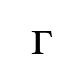

### Фото инвертированной буквы

### Профили буквы
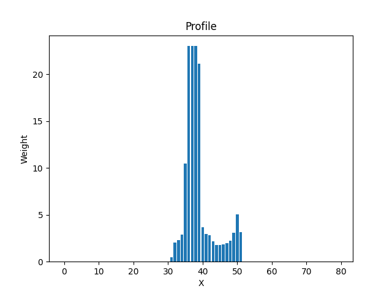
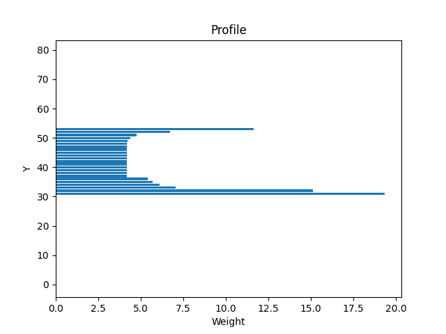

### Признаки:
1. Вес I - 43.40392156862745
2. Относительный вес I - 0.027127450980392157
3. Вес II - 27.886274509803922
4. Относительный вес II - 0.01742892156862745
5. Вес III - 64.85882352941177
6. Относительный вес III - 0.040536764705882355
7. Вес IV - 4.6
8. Относительный вес IV - 0.002875
9. Общий вес - 140.74901960784314
10. Относительный общий вес - 0.02199203431372549
11. Центр тяжести Y - 40.43236465966398
12. Центр тяжести X - 38.9533309186147
13. Относительный центр тяжести Y - 0.5054045582457998
14. Относительный центр тяжести X - 0.4869166364826837
15. Момент инерции Y - 2728.9679579948224
16. Момент инерции X - 8506.959079260134
17. Относительный момент инерции Y - 6.662519428698297e-05
18. Относительный момент инерции X - 0.00020768943064599935

## Вывод по работе
В ходе выполнения лабораторной работы были выделены признаки символов казахского алфавита. Для каждого символа были рассчитаны вес, относительный вес, координаты центра тяжести, моменты инерции и их нормированные значения. Также были построены профили X и Y для каждого символа. Полученные данные могут быть использованы для дальнейшего анализа и классификации символов.
